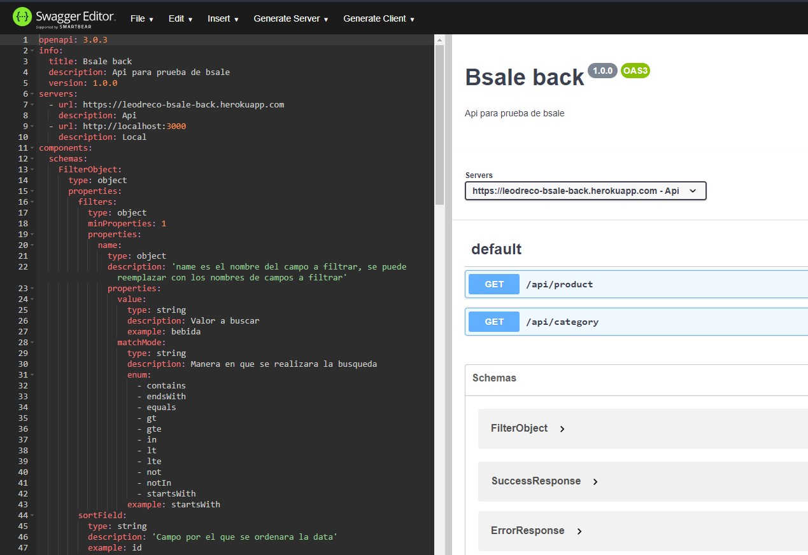

# bsale-back

Api rest en typescript con express.js y el ORM Prisma
Filtros, paginación.

Proyecto front: https://github.com/leodreco/bsale-front

Visualisar el proyecto en: https://leodreco.github.io/bsale-front/public

## Iniciar la aplicacion en local
Crear un archivo .env con la conexion a la db con el formato que se encuenta en .env.example
Correr los siguientes comandos
```
    npm ci
    npx prisma generate
    npm run test
```

## Documentacion openapi
La documentación completa del api se encuentra en el archivo openapi.yaml.
Desde ahi se puede ver los Request, Schemas, Responses, Params usados y probar el api.

Abrirlo o copiar pegar en https://editor.swagger.io/


## Prisma
Para agregar tablas y modelos, estos se tienen que definir en /prisma/schema.prisma y correr el comando ```npx prisma generate```

## Filtros
Los filtros en la request se getionan en src/middlewares/FilterMiddleware
Si se necesita agregar mas variables en el req, modificar el Request en @types/express.d.ts
